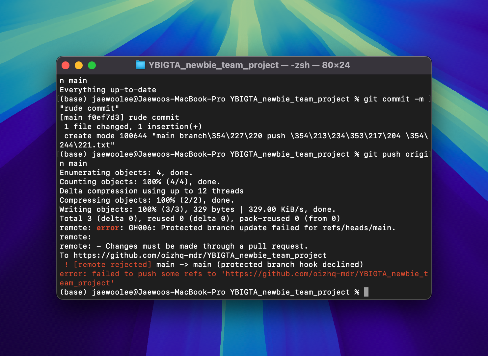

# YBIGTA 26기 교육세션 3조

## Introduction

안녕하세요! YBIGTA 26기 교육세션 3조입니다.

### 팀원 소개
- 이준찬: gamma4638, 산업공학과 19학번
- 조요셉: kulusevski, 응용통계학과 21학번
- 이재우: oizhq-mdr, 언론홍보영상학부 20학번

## Attachments

### Branch Protection 관련

### Merge 완료

## Project Architecture

### MVC 패턴
MVC(Model-View-Controller) 패턴은 애플리케이션을 세 가지 주요 컴포넌트로 분리합니다:

- **Model**: DB와 상호작용하여 데이터를 관리
- **View**: 사용자에게 보여지는 인터페이스
- **Controller**: Model과 View 사이의 중개자 역할

### 프로젝트 구조
#### Model
- `user/user_repository.py`
- `user/user_schema.py`

#### View
- `static/index.html`

#### Controller
- `user/user_router.py`: 요청에 따른 서비스 호출 담당
- `user/user_service.py`: 비즈니스 로직 처리 (로그인, 회원가입, 비밀번호 업데이트, 회원 삭제)

### 실행 흐름
1. 사용자가 `http://127.0.0.1:8000/static/index.html`에서 요청
2. 요청이 Controller(`user_router`)로 전달
3. `user_router`가 적절한 엔드포인트를 `user_service`로 전달
4. `user_service`가 `user_repository`를 통해 DB 작업 수행
5. `user_service`의 처리 결과를 바탕으로 `user_router`가 응답 생성
6. 생성된 응답을 View(HTML)로 전달